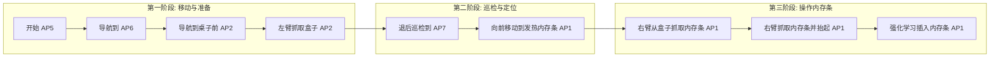

# FRANKA R3
### 环境要求


## 环境配置
    > Ubuntu 22.04
    > ROS 2 humble
    > Robot System Version:  要求>= 5.7.2 -- 满足 5.8.1
    > Robot serve 9 
    > libfranka Version 要求0.18.0>= 0.15.0 -- 满足 0.17.0
    > franka_ros2 (Humble) 要求 v2.0.2 < v3.0.0 满足 2.2.1
* Desk帐号：franka / franka_so
* 密码：franka123  / frankaso123
* workspace：franka_ros2_ws
## Franka 配置
* 先通过网线连接机械臂，在网址输入：`robot.franka.de`进入Desk 
    > 在setting中设置静态IP：172.16.0.2 掩码：255.255.252.0
    >> 把PC也设置为静态IP，在相同网段都可访问机械臂
--------------------------------------------------------
## 2.11
1.任务流程




## 2.9
1. 开发自定义控制器
   * 创建你的控制器包
   > `ros2 pkg create my_franka_controllers --build-type ament_cmake --dependencies controller_interface franka_semantic_components`
   * 编写控制器代码
   * 编译并安装
   > `colcon build --packages-select my_franka_controllers
      source install/setup.bash`
   * 创建控制器配置文件
   > `# config/controllers.yaml
      controller_manager:
      ros__parameters:
      my_custom_controller:
      type: my_franka_controllers/MyCustomController`
   * 启动并测试
   > `# 启动基础
      ros2 launch franka_bringup franka.launch.py robot_ip:=<ip> use_fake_hardware:=true  # 先用仿真测试`
    ` # 加载你的控制器
      ros2 control load_controller --set-state active my_custom_controller`
2. 双臂配置
   > [FCI_bringup_FR3_DUO](https://frankarobotics.github.io/docs/franka_ros2/franka_bringup/doc/index.html)
    1. 创建一个关键的配置文件
        fr3_duo.config.yaml
       ```
       # fr3_duo.config.yaml 示例
       robot_types: "['fr3', 'fr3']"        # 两台都是FR3型号
       arm_prefixes: "['right', 'left']"    # 为每条臂赋予唯一的前缀（如用于命名空间）
       robot_ips: "['172.16.0.2', '172.16.1.2']"  # 两条臂控制箱的实际IP地址
       ```
    2. 启动系统
       ```
       ros2 launch franka_bringup fr3_duo.launch.py \
       robot_config_file:=/path/to/your/fr3_duo.config.yaml \
       controller_name:=fr3_duo_joint_impedance_example_controller \
       use_fake_hardware:=true  # 先用仿真！
       ```
       >  * robot_config_file：指向你创建的配置文件路径。如果文件在 franka_bringup/config/ 目录下，可以只写文件名
       >  * controller_name：指定要加载的双臂控制器。官方提供了一个名为 fr3_duo_joint_impedance_example_controller 的示例控制器。
       检查状态 `ros2 topic list | grep franka_state  # 应能看到 right 和 left 前缀的状态话题 `
                 `ros2 control list_controllers        # 检查控制器状态是否为 “active”`
   3. 如果使用fr3_duo.launch, 则只能使用力矩控制接口控制

## 2.6
 1. 编辑机械臂双相机的配置文件
> left_right_sensor_suite.yaml

# 双臂franka
## To-do List
- [ ]移动到内存条上方，夹爪对准内存条
- [ ]机械臂向下抓取内存条
- [ ]机械臂将抓取的内存条放在桌子上
- [ ]再从另外一个位置再抓取一个内存条拿在机械臂夹爪上
---------------------------------------------------------
## 2.5
 1. 运行示教模式
> 容易出现force throshold错误
>>扩大force throshold的值，并换一个更稳的桌子
 2. 运行`ros2 launch franka_bringup franka.launch.py robot_type:=fr3 robot_ip:=<fci-ip> use_rviz:=true`
> 无报错，但不显示rviz
>>
3. 创建安全员，并配置watchman
> 可设置机械臂安全工作空间
4. 通过franka_ros2 控制夹爪
> `ros2 launch franka_bringup example.launch.py controller_names:=gripper_example_controller gripper=true`
  
## 2.4 
 1. Pico 打通
 2. Local Machine Installation 
  按照README安装，可能出现rosdep错误
 > rosdep install --from-paths src --ignore-src --rosdistro humble -y
 3. 成功安装franka_ros2
 4. Test the build 
> `colone test`成功
> >命令：` ros2 launch franka_fr3_moveit_config moveit.launch.py robot_ip:=dont-care use_fake_hardware:=true`
 4. ERROR: server 版本9，电脑libfranka版本10
> 问题：libfranka Version 要求0.18.0>= 0.15.0 现在0.19.0不满足
> >解决：降级libfranka 库到0.17.0
